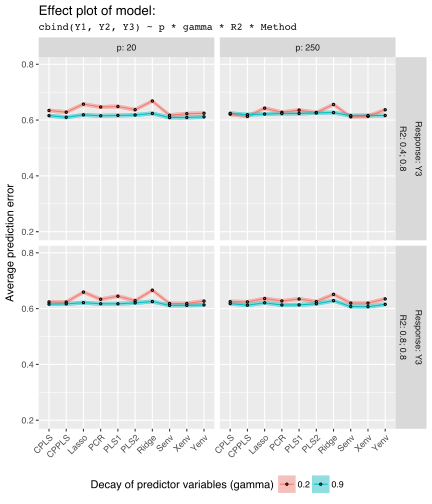

# <i class = "fa fa-toggle-off"></i> Introduction
- "Big Data" is becoming a focal discussion in most of the discipline 
- Massive explosion of data with informations integrated in many variables and features
- New methods and algoriths are being devised inorder to extract such information and study the relationship between different variables
- Modern inter-disciplinary research fields such as chemometrics, echonometrics and bioinformatics are handling multi-response models extensively
- This paper attempts to compare some of such methods and their performance on linear model data with specifically designed properties

## <i class="fa fa-terminal"></i> Background
- Discuss some previous study on comparison specifically on multi-response setting
- Discuss the experimenal design settings on those papers
- What is new thing about this paper that other have not done

## <i class="fa fa-terminal"></i> Objective
- Demonstrate a systematic comparison study using SimrelM
- Compare new estimation methods with conventional methods using data with properties particularly constructed for comparison

---

# <i class = "fa fa-toggle-off"></i> Statistical Model
- Simulation model
$$
\begin{bmatrix}
\mathbf{y} \\ \mathbf{x}
\end{bmatrix} \sim \mathbf{N}\left(
\begin{bmatrix}
\boldsymbol{\mu}_{y} \\
\boldsymbol{\mu}_x
\end{bmatrix},
\begin{bmatrix}
\boldsymbol{\Sigma}_{yy} & \boldsymbol{\Sigma}_{yx} \\
\boldsymbol{\Sigma}_{xy} & \boldsymbol{\Sigma}_{xx}
\end{bmatrix}
\right)
$$
- Define transformation as $\mathbf{z} = \mathbf{Rx}$ and $\mathbf{w} = \mathbf{Qy}$
- Equivalent latent model will be,
$$
\begin{bmatrix}
\mathbf{w} \\ \mathbf{z}
\end{bmatrix} \sim \mathbf{N}\left(
\begin{bmatrix}
\boldsymbol{\mu}_{w} \\
\boldsymbol{\mu}_x
\end{bmatrix},
\begin{bmatrix}
\boldsymbol{\Sigma}_{ww} & \boldsymbol{\Sigma}_{wz} \\
\boldsymbol{\Sigma}_{zw} & \boldsymbol{\Sigma}_{zz}
\end{bmatrix}
\right)
$$

- <span class='red'>_How much should I discuss about simrel-M??_</span>

---

# <i class = "fa fa-toggle-off"></i> Exerimental Design
- Parameters with single level:
    - Number of observations (`n`): 100
    - Number of response variables (`m`): 3
    - Number of informative response components: 2
    - Position of predictor components relevant for response components (`relpos`): 1, 4; 2, 3
    - <span class="red">_Something smart_ </span>(`ypos`): 1; 2, 3
    
- Parameters with multiple level:
    - Number of predictor variables (`p`): 2 levels
    - Decay factor of eigenvalues corresponding to predictors (`gamma`): 2 levels
    - Decay factor of eigenvalues corresponding to response (`eta`): 2 levels
    - Coefficient of determination corresponding to each informative response compnents`R2`: 2 levels

---

# <i class = "fa fa-toggle-off"></i> Estimation Methods
- Methods used in the study and their short description (how they estimate, what are they based on)

    1. Principal Component Regression (PCR)
    2. Partial Least Squares 1 (PLS1)
    3. Partial Least Squares 2 (PLS2)
    4. Cannonical Partial Least Squares (CPLS)
    5. Cannonically Powered Partial Least Squares (CPPLS)
    6. Envelope Estimation in Predictor Space (Xenv)
    7. Envelope Estimation in Response Space (Yenv)
    8. Simulteneous envelope estimaion (Senv)
    9. Ridge Regression (Ridge)
    10. Lasso Regression (Lasso)
    
- <span class = "red">_How details should I discuss about these methods in terms their way of estimation and difference between them_</span>
- As _Xenv_, _Yenv_ and _Senv_ are based on maximum likelihood estimation, principal components of predictors explaining 99.5% of their variation are used.

---

# <i class = "fa fa-toggle-off"></i> Exploratory Study
- This section explores the inter-connection between the estimation methods and the properties of data based on regression coefficients
- Our discussion revolve around following factors and their interaction
    - Wide vs Tall predictor matrix
    - High vs Low multicollinearity
    - High vs Low correlation between responses
    - Hight vs Low coefficient of determination

---

# <i class = "fa fa-toggle-off"></i> Systematic Comparison
- <span class="red">_Should we use MANOVA model or some kind of norm/trace or similar measure for the error and use ANVOA instead?_</span>
- A MANOVA model is used for statistical analysis
    $$\mathtt{pred\_err}_{ijkl} = \mu + \mathtt{p}_i * \mathtt{gamma}_j * \mathtt{r2}_k * \mathtt{method}_l + \epsilon_{ijkl}$$
- In the model the prediction error for each of three response variables are used as response variable and following variables (with levels) and their complete interactions are used as predictor variables.

    a) Number of predictor variables $(p)$: 20 and 100
    b) Decay factor of eigenvalues of $X$ $(\gamma)$: 0.2 and 0.8
    c) Decay factor of eigenvalues of $Y$ $(\eta)$: 0.1 and 0.6
    d) Coefficient of Determination $(\rho)$: 0.4, 0.4 and 0.4, 0.8
    e) Method of estimation: PCR, PLS1, PLS2, CPLS, CPPLS, Xenvelope, Yenvelope, Senvelope, Ridge and Lasso
    f) Number of tuning Parameters used (as numeric)
- An effect plot for fitted MANOVA model,
    ```{r, echo = FALSE, out.width="90%"}
    
    ```


---

# <i class = "fa fa-toggle-off"></i> Discussion and Conclusion

---

<script>
<!-- $('.section') -->
<!--   .find(':header') -->
<!--   .siblings('ol, ul') -->
<!--   .not(':eq(7)') -->
<!--   .hide(); -->
$('.section').find('h1').click(function(){
	if($(this).siblings('ol, ul').is(':hidden')) {
	  $(this)
	  .find('i')
	  .removeClass('fa-toggle-off')
	  .addClass('fa-toggle-on');
	} else {
	  $(this)
	  .find('i')
	  .removeClass('fa-toggle-on')
	  .addClass('fa-toggle-off');
	}
})
$('.section').find(':header').click(function(){
	$(this).siblings('ol, ul').toggle();
});
</script>